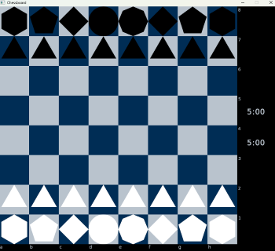

# Chess-Ai

Initial idea is to create a simple chess 'ai' that can play at a very basic level. Choosing C++ for its object-oriented workflow, and to learn as well. Will be creating the game first and setting rules for potential ai/machine learning

## Features

- All chess pieces implemented
- Both mouse and text input
- Game timer that alternates
- Takebacks and game history

## Prerequisites

- A C++ 64-bit compiler (ex. GCC, Clang, MSVC)
- Simple and Fast Multimedia Library (SMFL)
- Basic make and lib linking knowledge

### Building

```mingw32-make``` ```make```


## Roadmap
- Highlight squares on click
- Replace shapes with sprites
- ~~Place pieces in a forward thinking manner~~ 
- ~~Make pieces mouse movable~~
- Improve game history
- Implement an AI opponent


## Acknowledgments
- SMFL - https://github.com/SFML/SFML 
- Lichess - General shoutout for being FOSS and ad free 🌱
