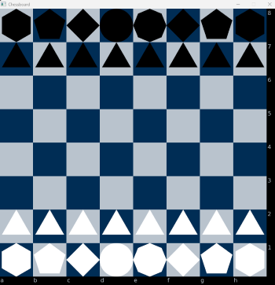

# Chess-Ai

Initial idea is to create a simple chess 'ai' that can play at a very basic level. Choosing C++ for its object-oriented workflow, and to learn as well. Will be creating the game first and setting rules for potential ai/machine learning

## Prerequisites

- A C++ 64-bit compiler (ex. GCC, Clang, MSVC)
- Simple and Fast Multimedia Library (SMFL)
- Basic make and lib linking knowledge

### Building

```mingw32-make``` ```make```


## Roadmap
- Highlight squares on click
- Place pieces in a forward thinking manner 
- Make pieces movable

## Design Choices
- When thinking about chess, I tend to think of each piece as being unique in its own right. Not just something that is instanced onto a surface

- To solve this, Im currently trying a type based solution in combination with object id's to wrangle the objects

